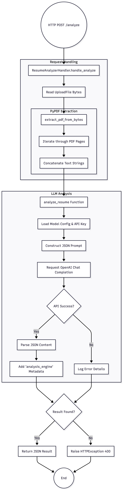

# Resume Analyzer

AI-powered resume analyzer that compares resumes against job descriptions using OpenAI's API.

## Features

- Upload resume PDFs
- Compare against job descriptions
- Get matching score, skills analysis, and concerns
- Web UI for easy interaction
- RESTful API endpoints

### Flowchart


## Quick Start

### Local Development

1. **Install dependencies:**
   ```bash
   pip install -r requirements.txt
   ```

2. **Set up environment variables:**
   ```bash
   cp .env.example .env
   # Edit .env with your OpenAI API key
   ```

3. **Run the server:**
   ```bash
   python3 main.py
   ```

4. **Access the app:**
   - Open http://localhost:8000 in your browser

### Docker Deployment

**Option 1: Using docker-compose (Recommended)**

1. **Set up environment:**
   ```bash
   cp .env.example .env
   # Edit .env with your OpenAI API key
   ```

2. **Build and run:**
   ```bash
   docker-compose up --build
   ```

3. **Access:**
   - Web UI: http://localhost:8000
   - API docs: http://localhost:8000/docs

**Option 2: Using Docker directly**

1. **Build the image:**
   ```bash
   docker build -t resume-analyzer .
   ```

2. **Run the container:**
   ```bash
   docker run -p 8000:8000 \
     -e OPENAI_API_KEY=your_api_key_here \
     -v $(pwd):/app \
     resume-analyzer
   ```

## API Endpoints

- `GET /` - Serve web UI (index.html)
- `POST /analyze` - Analyze resume against job description
  - Parameters: `resume` (file), `job_description_text` (text)
- `GET /health` - Health check
- `GET /docs` - Swagger API documentation

## Environment Variables

- `OPENAI_API_KEY` - Your OpenAI API key (required)
- `OPENAI_MODEL` - Model to use (default: gpt-4o-mini)

## File Structure

```
.
├── main.py              # FastAPI application
├── index.html           # Web UI
├── Dockerfile           # Docker image definition
├── docker-compose.yml   # Docker Compose configuration
├── requirements.txt     # Python dependencies
├── .env.example         # Example environment variables
└── JD.txt              # Sample job description
```

## Troubleshooting

**Container exits immediately:**
- Check logs: `docker-compose logs resume-analyzer`
- Verify OPENAI_API_KEY is set in .env

**Port 8000 already in use:**
- Change port in docker-compose.yml: `8001:8000`

**PDF extraction fails:**
- Ensure resume PDF is valid
- Check logs for detailed error messages
